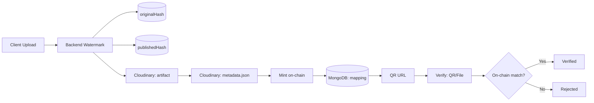

## 🌐 Blockchain Certificate System – Tổng quan dự án mở rộng

Nền tảng phát hành, lưu trữ, xác thực và khai thác giá trị của chứng chỉ và tài sản số trên blockchain.

---

## 🎯 1) Tầm nhìn

Blockchain Certificate System hướng đến: chống giả mạo, xác thực nhanh, và tạo cơ hội kinh tế cho người sở hữu nội dung số.

---

## 🚀 2) Ý tưởng cốt lõi

### 🔹 Giai đoạn MVP

- Một tổ chức phát hành duy nhất (Issuer) tạo chứng chỉ minh bạch on-chain.
- Mỗi chứng chỉ là NFT dạng SBT (non-transferable) gắn với SHA‑256 hash.
- File được watermark, lưu trữ, mint on-chain; người nhận quét QR hoặc upload file để xác thực.

> Hiểu đơn giản: “Google Drive trên blockchain” – mỗi file có bản sao on-chain, bất biến, chứng minh nguồn gốc và tính xác thực.

### 🔹 Giai đoạn mở rộng (User Upload & Leasing)

- Người dùng có thể đăng ký quyền sở hữu nội dung số (ảnh, tài liệu, video, sản phẩm sáng tạo…).
- Mint thành NFT theo chuẩn ERC‑4907 để cho thuê (leasing) quyền sử dụng có thời hạn.
- Người thuê có quyền truy cập tạm thời, chủ sở hữu gốc vẫn giữ quyền sở hữu.

Kết quả: mở rộng từ chứng chỉ học tập → Digital Asset Registry & Leasing Platform.

---

## 🧩 3) Công nghệ & Quy trình

### Quy trình chính

- Upload → Watermark → Hash → Upload storage → Mint → QR → Verify

### Dual‑Hash Strategy (chuẩn hóa)

- originalHash: SHA‑256 của file gốc (trước watermark).
- publishedHash: SHA‑256 của file đã watermark (sử dụng để mint on‑chain và xác thực công khai).
- Nếu người dùng gửi file gốc, backend có thể nhận diện qua originalHash trong DB và suy ra publishedHash để đối chiếu on‑chain.

### Công nghệ

- Frontend: Next.js (QR, Upload, Verify, Dashboard)
- Backend: Express (TypeScript, Multer, Cloudinary, Ethers.js)
- Blockchain: Solidity (OpenZeppelin ERC‑721, ERC‑4907, SBT), Sepolia testnet
- Database: MongoDB (Mongoose) – mapping hash ↔ tokenId
- Storage: Cloudinary → IPFS (tương lai)

---

## 🏗️ 4) System Architecture

### Mô tả pipeline

1. Client upload file → Backend nhận file (Multer, memory storage)
2. Backend watermark file → tính originalHash và publishedHash
3. Upload artifact (đã watermark) lên Cloudinary → trả về URL
4. Tạo metadata.json → upload Cloudinary (hoặc IPFS trong tương lai)
5. Mint on‑chain: SBT (CertificateSBT) hoặc 4907 (CreativeAsset4907)
6. Lưu DB: tokenId, owner, chainId, contract, originalHash, publishedHash, URLs
7. Tạo QR (verify URL) → FE hiển thị
8. Verify: quét QR hoặc upload file → backend đối chiếu on‑chain



---

## 🔌 5) API Overview

| Endpoint                  | Method | Mục đích                          | Body/Query chính                                       | Trạng thái      |
| ------------------------- | ------ | --------------------------------- | ------------------------------------------------------ | --------------- |
| `/api/certificate/mint`   | POST   | Mint SBT chứng chỉ                | form-data: `file`, `owner`                             | MVP (đã có)     |
| `/api/certificate/verify` | POST   | Verify bằng upload file           | form-data: `file`, body: `tokenId` (tùy chọn)          | MVP (đã có)     |
| `/api/certificate/verify` | GET    | Verify bằng QR (tokenId)          | query: `tokenId`, `contract`, `chain`, `type?`, `sig?` | V1.1 (kế hoạch) |
| `/api/creative/lease`     | POST   | Thiết lập user/expires (ERC‑4907) | body: `tokenId`, `user`, `expires`                     | MVP (cho 4907)  |
| `/api/creative/verify`    | GET    | Tra cứu thông tin 4907            | query: `tokenId`, `contract`, `chain`                  | V1.1 (kế hoạch) |

> Lưu ý: Route prefix hiện tại trong backend: `app.use('/api/certificate', ...)`.

### Phản hồi mẫu (Verify qua QR)

```json
{
  "tokenId": "123",
  "contract": "0x906C...",
  "chain": 11155111,
  "owner": "0x1234...",
  "issuer": "FPT University",
  "hash": "0xABC...",
  "tokenURI": "https://cloudinary.com/metadata/123.json",
  "status": "verified"
}
```

---

## 🗄️ 6) Database Schema Overview

### Certificate (MVP mở rộng)

| Trường            | Kiểu                 | Mô tả                                               |
| ----------------- | -------------------- | --------------------------------------------------- |
| `originalHash`    | bytes32 (hex string) | Hash file gốc (pre‑watermark), index                |
| `publishedHash`   | bytes32 (hex string) | Hash file phát hành (post‑watermark), unique, index |
| `fileHash`        | bytes32 (hex string) | Alias của `publishedHash` (back‑compat)             |
| `tokenId`         | string               | Token ID on‑chain                                   |
| `owner`           | string               | Ví sở hữu (EOA / Account Abstraction)               |
| `contractAddress` | string               | Địa chỉ contract                                    |
| `chainId`         | number               | Chain ID (vd 11155111)                              |
| `tokenURI`        | string               | URL metadata.json                                   |
| `fileUrl`         | string               | URL artifact đã watermark                           |
| `metadataUrl`     | string               | URL metadata trên Cloudinary/IPFS                   |
| `transactionHash` | string               | Tx hash mint                                        |
| `status`          | enum                 | minted/pending/failed                               |

### Asset (ERC‑4907) – đề xuất

| Trường            | Kiểu    | Mô tả                                  |
| ----------------- | ------- | -------------------------------------- |
| `fileHash`        | bytes32 | Hash artifact (tương tự publishedHash) |
| `tokenId`         | string  | Token ID                               |
| `owner`           | string  | Chủ sở hữu                             |
| `user`            | string  | Người được cấp quyền sử dụng           |
| `expires`         | number  | Unix time hết hạn quyền sử dụng        |
| `contractAddress` | string  | Địa chỉ contract ERC‑4907              |
| `chainId`         | number  | Chain ID                               |
| `tokenURI`        | string  | Metadata URL                           |

### Issuer – đề xuất (Multi‑Issuer)

| Trường   | Kiểu   | Mô tả                        |
| -------- | ------ | ---------------------------- |
| `name`   | string | Tên tổ chức phát hành        |
| `wallet` | string | Ví ký phát hành / ký EIP‑712 |
| `domain` | string | Phạm vi/brand cho verify URL |
| `policy` | object | Quy tắc phát hành & xác thực |

---

## 🧾 7) QR & Verification Flow

### QR Data

`https://yourdomain.com/verify?tokenId=123&contract=0x906CE80762bd747526aeccc7Bff38118bB4b7911&chain=11155111&type=sbt&sig=...`

| Tham số           | Ý nghĩa                 | Ghi chú                    |
| ----------------- | ----------------------- | -------------------------- |
| `tokenId`         | ID chứng chỉ NFT        | Lấy metadata / verify hash |
| `contract`        | Địa chỉ contract        | Phân biệt SBT / 4907       |
| `chain`           | Chain ID (vd 11155111)  | Cross‑chain verify         |
| `type` (tùy chọn) | Loại token (sbt/4907)   | Điều chỉnh UI/ABI          |
| `sig` (tùy chọn)  | Chữ ký Issuer (EIP‑712) | Chống giả mạo URL          |

### Luồng xác thực

- QR → FE mở `/verify?...` → FE gọi BE: `GET /api/certificate/verify?...`
- BE đọc `tokenId/contract/chain/type` → đọc `ownerOf`, `tokenURI` → (nếu có file) đối chiếu `verifyHash(tokenId, publishedHash)` trên contract.

---

## 🔐 8) Security & Validation Rules

- **Access control**:
  - SBT/4907 mint: `onlyOwner` trên contract.
  - 4907 `setUser`: chỉ chủ sở hữu được phép.
- **Input validation**: MIME whitelist, giới hạn kích thước, Express‑Validator cho params.
- **Hashing strategy**: Dual‑hash (original/published). On‑chain dùng `publishedHash`.
- **Double‑mint prevention**:
  - Cloudinary: kiểm tra tồn tại (public_id = publishedHash) → 409 Conflict.
  - DB: `publishedHash` unique; `fileHash` alias giữ back‑compat.
- **Rate limiting & abuse**: Đề xuất sử dụng `express-rate-limit`, captcha cho public verify API nếu cần.
- **Replay & tampering**: Verify URL có `sig` (EIP‑712) từ Issuer (tùy chọn). Lưu `chainId`/`contractAddress` để chống nhầm lẫn.
- **Privacy**: Không lưu file gốc; chỉ lưu artifact đã watermark và metadata công khai.

---

## 🧪 9) Environment Setup & Run Instructions

### Yêu cầu

- Node.js >= 18
- MongoDB (Atlas hoặc self‑hosted)
- Cloudinary account

### Biến môi trường (`.env`)

```bash
PORT=3000

# Database
DB_NAME=your_db
DB_PASSWORD=your_password

# Blockchain
RPC_URL=https://sepolia.infura.io/v3/xxx
PRIVATE_KEY=0xabc...
CHAIN_ID=11155111
CERTIFICATE_CONTRACT_ADDRESS=0xYourSBT
CREATIVE4907_CONTRACT_ADDRESS=0xYour4907   # nếu dùng

# Cloudinary
CLOUDINARY_CLOUD_NAME=xxx
CLOUDINARY_API_KEY=xxx
CLOUDINARY_API_SECRET=xxx

# Verify
VERIFY_BASE_URL=https://yourdomain.com/verify
```

### Cài đặt & chạy

```bash
npm install
npm run dev  # hoặc: npm run start
```

---

## 🗺️ 10) Roadmap & Future Expansion

### V1.0 (MVP)

- SBT issuing & verify (upload file / QR tokenId)
- Dual‑hash storage (original/published)
- Cloudinary storage, MongoDB mapping

### V1.1

- GET verify by tokenId/contract/chain
- QR image generation & deep link
- ERC‑4907 verify endpoints

### V2.0 (B2B)

- Multi‑Issuer (tách bảng `Issuer`, policy per issuer)
- IPFS/Filecoin storage (ipfs:// metadata & files)
- Attestation & Signature (EIP‑712/JWS)

### V3.0 (C2C & Marketplace)

- Leasing marketplace (ERC‑4907) + fee model
- Webhook & public API for third‑parties (HR/LMS)
- Reputation system

### V4.0 (Web3 Economy)

- Cross‑chain support (BNB, Polygon, Linea, Base...)
- Tokenomics (optional) – mint/verify/reward

---

## 🤝 11) AI Collaboration Note

- Mục tiêu: giữ cho kiến trúc modul hóa, mở rộng, và an toàn (best practices Starknet/EVM & Cairo/Solidity).
- Ưu tiên: tách interface rõ ràng (ABI, storage layout), phát hành nhiều phiên bản an toàn, và test coverage cao.
- Khi mở rộng: hãy tuân thủ chiến lược dual‑hash, chuẩn metadata, event emission đầy đủ để phục vụ indexing.
- Gợi ý AI: có thể tự động sinh route/ABI mapping, migration DB, và CI/CD (compile, test, deploy, version hóa class hash/bytecode).

---

## 💡 12) Giá trị cốt lõi

| Giá trị               | Giải thích                                          |
| --------------------- | --------------------------------------------------- |
| **Minh bạch**         | Hash, issuer, metadata công khai on‑chain           |
| **Không thể giả mạo** | File được watermark rồi hash SHA‑256                |
| **Xác thực nhanh**    | QR hoặc upload file → kiểm tra on‑chain tức thì     |
| **Tự chủ sở hữu**     | Người dùng tự quản lý, đăng ký, cho thuê tài sản số |
| **Mở rộng linh hoạt** | Từ chứng chỉ → tác phẩm sáng tạo → tài sản trí tuệ  |

---

## 🔮 13) Tương lai xa hơn

- DAO Governance: cộng đồng issuer/verifier quản lý whitelist & tiêu chuẩn metadata.
- AI Verification: phát hiện file giả mạo qua phân tích hình ảnh + hash.
- LMS/HRM Integration: tự động cấp chứng chỉ sau khi hoàn thành khóa học/kỳ thi.
- Decentralized Audit Logs: lưu lịch sử verify trên chuỗi.

Rất hay — tài liệu bạn viết thực ra đã rất gần với một Business Requirement Specification (BRS) hoàn chỉnh.
Dưới đây là phần phân tích business rule (quy tắc nghiệp vụ) được trích ra và diễn giải từ toàn bộ thiết kế của bạn, chia thành các lớp: Actor → Process → Constraint → Validation → Compliance → Monetization.

🧩 I. Actors & Roles
Vai trò Quyền hạn chính Mục tiêu nghiệp vụ
Issuer (Tổ chức phát hành) Upload file, watermark, mint SBT, ký xác thực (EIP-712) Cấp chứng chỉ, đảm bảo tính xác thực
User (Người dùng cuối) Upload nội dung, đăng ký sở hữu, mint ERC-4907 Đăng ký & cho thuê tài sản sáng tạo
Verifier (Bên xác thực) Quét QR hoặc upload file để kiểm chứng Kiểm tra tính hợp lệ của chứng chỉ hoặc file
System (Backend) Tự động hóa hash, lưu trữ, mint, verify, watermark, log Đảm bảo pipeline đúng và minh bạch
